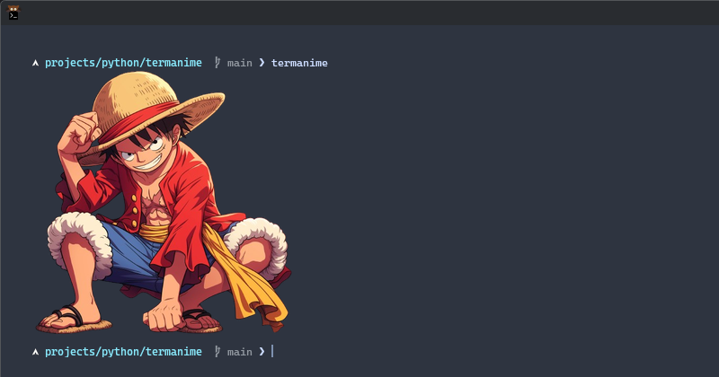

# termanime

>Display your favorite anime images directly in your Kitty terminal — with themes, customization, and CLI control.

**termanime** is a lightweight Python command-line tool that prints anime images right inside your Kitty terminal.  
It supports user-created themes, automatic image resizing, and a simple configuration system.

---

## ✨ Features

- Display anime images directly in the terminal (Kitty only)
- Manage multiple **themes**
- Add or remove images to themes
- Enable or disable display with one command
- Configuration stored in `~/.config/termanime/termanime.conf`
- Themes stored in `~/.themes/termanime/`

---

## 📦 Installation

You can install `termanime` easily using the provided **install script**:

```bash
git clone https://github.com/atharva-nlt/termanime-py.git
cd ./termanime-py
./install.sh
```
## Images

<div align="center">
  
</div>
